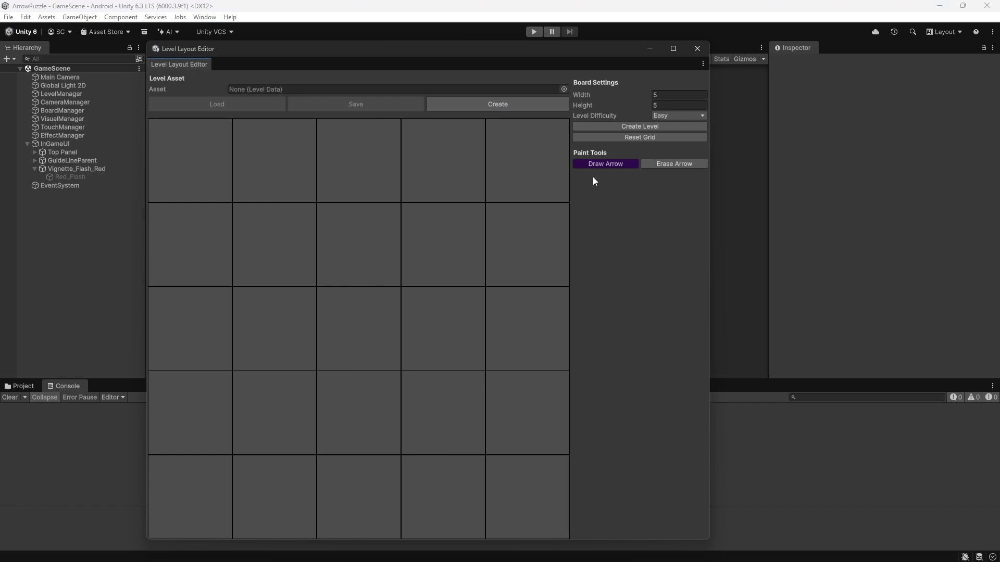

# 🧩 Arrow Puzzle Prototype

A 2D grid-based logic puzzle game developed in Unity. The objective is simple: tap arrows in the right order so each one can slide out of the board without colliding with another arrow.

The project focuses on **clean runtime architecture, mobile-ready input, custom Unity editor tooling, and procedural level generation** for fast puzzle iteration.

## 🎮 Gameplay

- Tap an arrow to attempt a move in the direction its head is facing.
- If the path from the arrow head to the edge of the board is clear, the arrow slides out and is removed.
- If another arrow blocks the path, the move is rejected with visual feedback.
- A level is complete when every arrow has escaped the board.

  

## 🕹️ Controls

- **Tap an arrow:** Attempts to move the selected arrow in the direction it is facing.
- **Swipe:** Pans the camera across the board.
- **Pinch in/out:** Zooms the camera in or out.

## 🚀 How to Run

1. Clone or download the project.
2. Open the project folder in Unity `6000.3.9f1` or a compatible Unity 6 version.
3. Open `Assets/Scenes/MainMenu.unity` or `Assets/Scenes/GameScene.unity`.
4. Press Play in the Unity Editor.

## ✨ Key Features

- **Grid-based arrow logic:** Each arrow is stored as an ordered list of cells from tail to head, which keeps movement, rendering, and editor serialization easy to reason about.
- **Mobile-first controls:** The input layer supports tap detection, swipe panning, and pinch zoom through Unity's Input System.
- **Dynamic arrow visuals:** Runtime arrows are rendered from path data, with animated escape movement, blocked-move feedback, and guide lines.
- **ScriptableObject levels:** Puzzle layouts are saved as reusable `LevelData` assets.
- **Custom tooling:** Levels can be hand-authored or procedurally generated directly inside the Unity Editor.

## 🛠️ Custom Level Editor

To rapidly design puzzles, I built a custom Unity Editor Window called `LevelBlueprintEditor`.

- **Continuous painting:** Intercepts mouse events through `Event.current` to support smooth click-and-drag arrow drawing directly on the grid.
- **Smart arrow rendering:** Automatically chooses tail, body, elbow, and head visuals based on the user's drag path.
- **Erase workflow:** Clicking any occupied cell in erase mode removes the entire arrow that owns that cell.
- **Safe data management:** Uses a working buffer while editing. Changes are previewed instantly, then serialized back into `ScriptableObject` assets only when explicitly saved.
- **Integrated generation:** The same editor can generate a full board from width, height, and difficulty settings, then let the designer manually tweak the result.

## 🧠 Procedural Level Generation

The level generator creates puzzles by placing snake-shaped arrows on a grid while continuously checking that the resulting board is still solvable.

At a high level, the algorithm works like this:

1. **Create the board search space.** The generator flattens the grid into cell indices and tracks used cells with a `HashSet`, making occupancy checks fast and simple.
2. **Tune arrow length by difficulty.** Every level uses a minimum arrow length of 2. The maximum length increases by difficulty: Easy uses shorter arrows, while Expert allows much longer snake paths.
3. **Try random start cells.** Free cells are shuffled so each generation pass explores the board in a different order.
4. **Grow snake paths with DFS.** From a chosen start cell, the generator runs a randomized depth-first search through unoccupied neighboring cells until it reaches the target length. This produces valid contiguous arrow paths with bends.
5. **Validate each candidate before committing it.** A candidate arrow is temporarily added, then the generator runs a solvability simulation.
6. **Simulate the solve order.** The solver repeatedly removes any arrow whose head has a clear straight-line path to the edge of the board. If every arrow can eventually be removed, the board is considered solvable.
7. **Avoid dead exits.** Candidate arrows are rejected when their current exit ray is already blocked by previously placed arrows. Later arrows can still create dependencies, but each newly placed arrow starts from a physically meaningful escape direction.
8. **Fill leftover cells carefully.** After the main placement pass, empty cells are attached to existing arrow tails or valid head extensions only if the board remains solvable afterward.

This gives the generator a useful balance: it is random enough to produce varied layouts, but every accepted step is constrained by the same movement rule the player uses in-game.

## 🏗️ Architecture Notes

- `LevelManager` loads `LevelData` assets and broadcasts level-load events.
- `BoardManager` owns the logical board state, validates moves, clears escaped arrows, and detects level completion.
- `VisualManager` spawns arrow and cell visuals from data.
- `LineArrow` builds the visible arrow path, handles escape animation, blocked movement, color feedback, and guide lines.
- `TouchManager` centralizes tap, swipe, and pinch input.
- `LevelGenerator` creates solvable procedural layouts for the editor.

## ⚙️ Tech Stack

- Unity
- C#
- Unity Input System
- ScriptableObjects
- Custom Unity Editor tooling
- PrimeTween for lightweight animation
